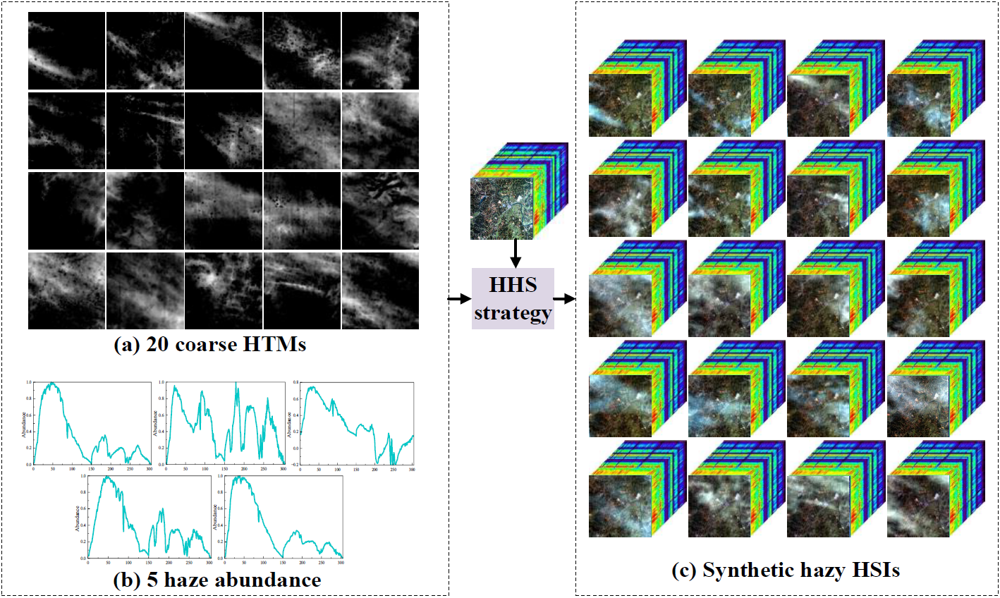
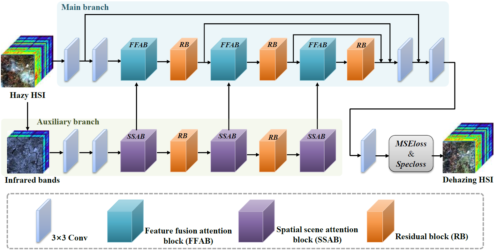

<div align="center">
<h1>HyperDehazing</h1>
<h3>HyperDehazing: A hyperspectral image dehazing benchmark dataset and a deep learning model for haze removal</h3>

Hang Fu, Ziyan Ling, [Genyun Sun](https://ocean.upc.edu.cn/2019/1107/c15434a224792/page.htm), [Jinchang Ren](https://www.xai-lab.org/), [Aizhu Zhang](https://ocean.upc.edu.cn/2019/1108/c15434a224913/page.htm), Li Zhang, [Xiuping Jia](https://scholar.google.com/citations?user=-vl0ZSEAAAAJ&hl=en)

Link: ([paper](https://doi.org/10.1016/j.isprsjprs.2024.09.034)) 

</div>

#

## Abstract
Haze contamination severely degrades the quality and accuracy of optical remote sensing (RS) images, including hyperspectral images (HSIs). Currently, there are no paired benchmark datasets containing hazy and haze-free scenes in HSI dehazing, and few studies have analyzed the distributional properties of haze in the spatial and spectral domains. In this paper, we developed a new hazy synthesis strategy and constructed the first hyperspectral dehazing benchmark dataset (HyperDehazing), which contains 2000 pairs synthetic HSIs covering 100 scenes and another 70 real hazy HSIs. By analyzing the distribution characteristics of haze, we further proposed a deep learning model called HyperDehazeNet for haze removal from HSIs. Haze-insensitive longwave information injection, novel attention mechanisms, spectral loss function, and residual learning are used to improve dehazing and scene reconstruction capability. Comprehensive experimental results demonstrate that the HyperDehazing dataset effectively represents complex haze in real scenes with synthetic authenticity and scene diversity, establishing itself as a new benchmark for training and assessment of HSI dehazing methods. Experimental results on the HyperDehazing dataset demonstrate that our proposed HyperDehazeNet effectively removes complex haze from HSIs, with outstanding spectral reconstruction and feature differentiation capabilities. Furthermore, additional experiments conducted on real HSIs as well as the widely used Landsat-8 and Sentinel-2 datasets showcase the exceptional dehazing performance and robust generalization capabilities of HyperDehazeNet. Our method surpasses other state-of-the-art methods with high computational efficiency and a low number of parameters.

## Datasets

**HyperDehazing:**  
1) Clear/haze-free HSIs covering 100 sences: [Clear HSIs](https://zenodo.org/records/13341168)
2) Synthetic hazy HSIs corresponding clear HSIs: [Sences 1-20](https://zenodo.org/records/13342233), [Sences 21-40](https://zenodo.org/records/13345255), [Sences 41-60](https://zenodo.org/records/13347827), [Sences 61-80](https://zenodo.org/records/13348682), [Sences 81-100](https://zenodo.org/records/13351755)
3) Real hazy HSIs covering 70 scenes: [Real hazy HSIs](https://zenodo.org/records/13351766)

<div align="center">

</div>
<br>

**Other dataset:**  

Hyperspectral Defogging dataset (HDD): ([Paper](https://ieeexplore.ieee.org/document/9511329))

## Proposed HyperDehazeNet  

The proposed HyperDehazeNet consists of two branches: the main branch (MB), an end-to-end full-wavelength attention network, and the auxiliary branch (AB), a longwave scene-based attention network. They are designed to leverage haze-insensitive scene details from longwave for comprehensive dehazing across all bands. Both the Feature Fusion Attention Blocks (FFAB) within the main branch and the Spatial Scene Attention Blocks (SSAB) within the auxiliary branch are designed to concentrate on haze-affected regions to enhance scene reconstruction. Residual blocks (RB) and skip connections support global residual learning and the fusion of deep and shallow features. 

<div align="center">

</div>
<br>

## Data Setting

```
┬─ data
    ├─ GF5
    │   ├─ train
    │   │   ├─ clear
    │   │   │   └─ 1.tif
    │   │   │   └─ ... (image filename)
    │   │   └─ hazy
    │   │       └─ 1_1.tif
    │   │       └─ 1_2.tif
    │   │       └─ 1_3.tif 
    │   │       └─ ... (corresponds to the former)
    │   └─ test
    │   │   ├─ clear
    │   │   │   └─ 20.tif
    │   │   │   └─ ... (image filename)
    │   │   └─ hazy
    │   │       └─ 20_1.tif
    │   │       └─ 20_2.tif
    │   │       └─ 20_3.tif 
    │   │       └─ ... (corresponds to the former)
```

## Other dehazing methods  

**CNN-based HSI dehazing methods:** 

SG-Net: ([Code](https://github.com/SZU-AdvTech-2022/158-A-Spectral-Grouping-based-Deep-Learning-Model-for-Haze-Removal-of-Hyperspectral-Images))  

AACNet: ([Code](http://www.jiasen.tech/papers/))  

**Transformer-based RS dehazing methods:** 

DehazeFormer: ([Code](https://github.com/IDKiro/DehazeFormer))  

AIDFormer: ([Code](https://github.com/AshutoshKulkarni4998/AIDTransformer))  

RSDformer: ([Code](https://github.com/MingTian99/RSDformer))

## Citation
If you find data is useful, please consider giving us a star 🌟 and citing it.

```bibtex
 @article{HyperDehazing,
  title={HyperDehazing: A hyperspectral image dehazing benchmark dataset and a deep learning model for haze removal},
  author={Hang Fu, Ziyan Ling, Genyun Sun, Jinchang Ren, Aizhu Zhang, Li Zhang, Xiuping Jia},
  journal={ISPRS Journal of Photogrammetry and Remote Sensing},
  year={2024}
}
```
